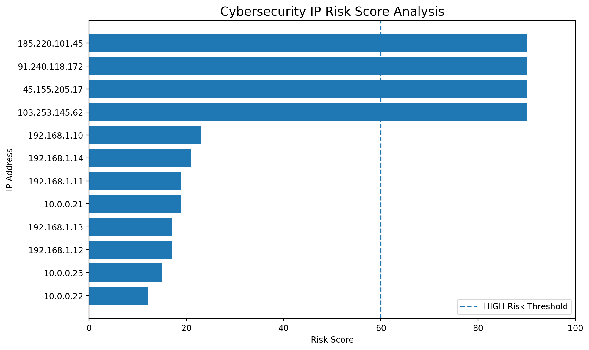
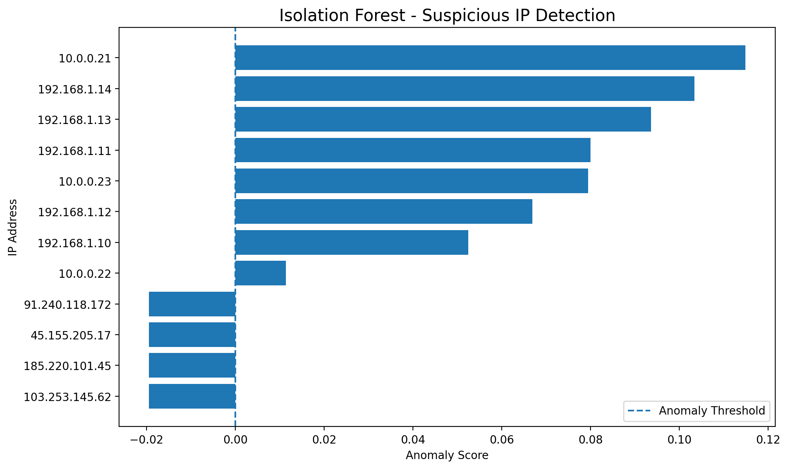

# Cybersecurity Log Analysis & Threat Detection

A cybersecurity project built with Python to analyze synthetic authentication logs and detect suspicious login activity.

## Project Overview

This project simulates a basic security log analysis workflow.

It includes:

- Failed login analysis
- Brute-force attack detection
- After-hours login analysis
- IP-based risk scoring
- Machine learning anomaly detection
- Excel-based security reporting

The dataset used in this project is synthetic and was created for educational and portfolio purposes.

## Technologies

- Python
- Pandas
- NumPy
- Matplotlib
- Scikit-learn
- Isolation Forest
- Microsoft Excel
- Google Colab

## Detection Logic

A potential brute-force attack is flagged when the same IP address generates 10 or more failed login attempts within a 15-minute period.

The project also analyzes:

- Failed login frequency
- After-hours activity
- Failure rate
- Unique user access
- Behavioral anomalies

## Risk Scoring

Each IP address receives a risk score based on:

- Maximum failed attempts within 15 minutes
- After-hours failed login attempts

High-risk IP addresses are then compared with machine learning results.

## Machine Learning

Isolation Forest is used for unsupervised anomaly detection.

Features used by the model include:

- Total login attempts
- Failed login attempts
- Failure rate
- Unique users
- Maximum failed attempts within 15 minutes
- After-hours failed login activity

## Results

- 5,120 authentication log events
- 599 failed login attempts
- 4 brute-force alerts
- 4 machine learning anomalies
- 4 critical IP addresses

## Excel Security Report

The project also generates an Excel report containing:

- Dashboard
- Final Analysis
- Security Alerts
- IP Risk Analysis
- ML Results
- Raw Logs

## Repository Files

- `Cybersecurity_Log_Analysis_Threat_Detection.ipynb`
- `Cybersecurity_Incident_Report_Professional.xlsx`
- `synthetic_authentication_logs.csv`
- `ip_risk_score.png`
- `ml_anomaly_detection.png`

## Disclaimer

This project was created for learning and portfolio purposes using synthetic security data.
